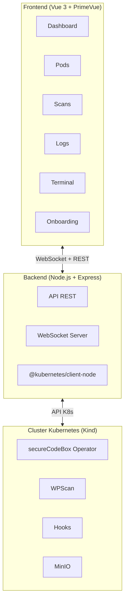
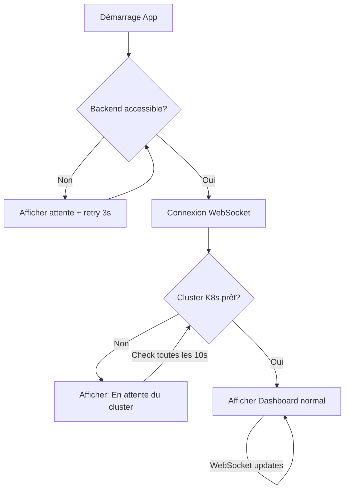
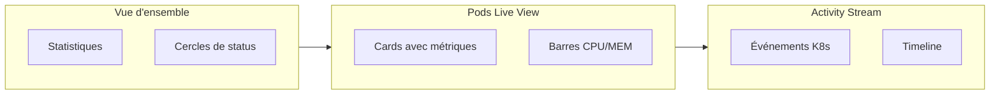
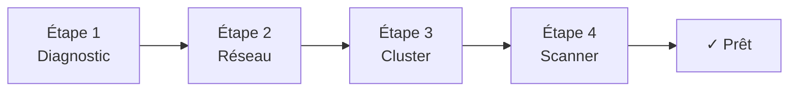
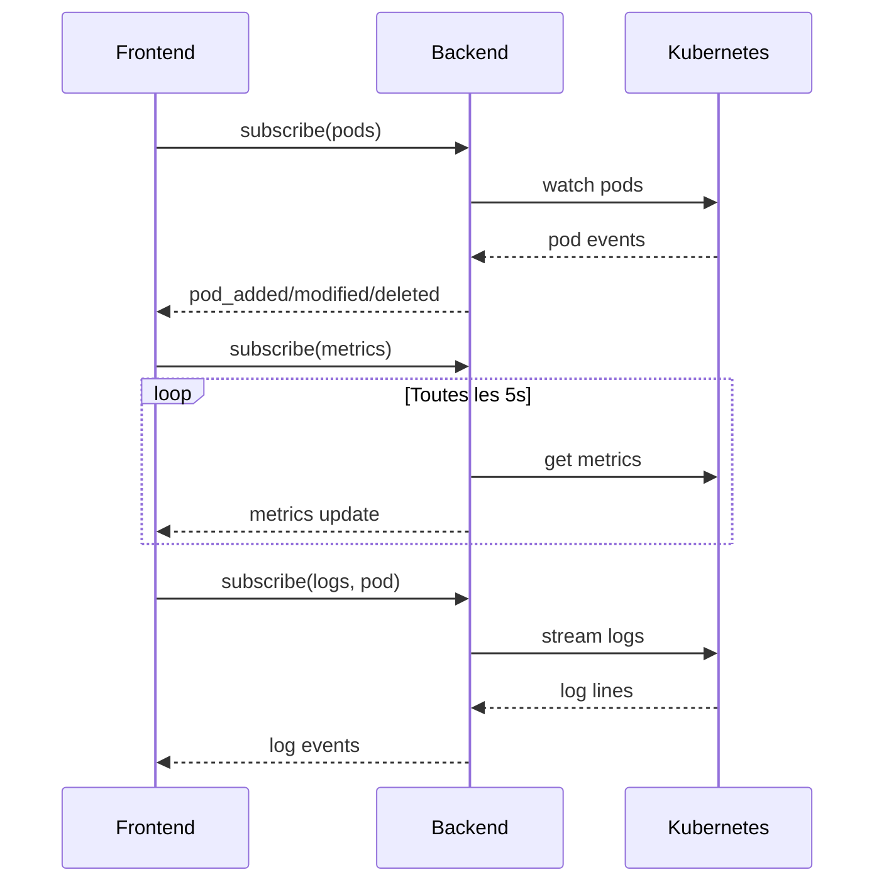

# vuejs.secureCodeBox.Dashboard

Interface Vue.js pour piloter **secureCodeBox** : visualiser les pods, leurs états, ports, métriques CPU/MEM, et streamer les logs en temps réel.

## Architecture



## Stack technique

| Composant      | Technologie             | Description                               |
| -------------- | ----------------------- | ----------------------------------------- |
| **Frontend**   | Vue 3 + TypeScript      | Framework réactif avec Composition API    |
| **UI**         | PrimeVue 3              | Composants UI (Terminal, DataTable, etc.) |
| **State**      | Pinia                   | Gestion d'état avec support WebSocket     |
| **Terminal**   | xterm.js                | Affichage des logs en temps réel          |
| **Backend**    | Node.js + Express       | Serveur API et proxy K8s                  |
| **K8s Client** | @kubernetes/client-node | SDK officiel Kubernetes                   |
| **Real-time**  | WebSocket (ws)          | Streaming logs et métriques               |
| **Build**      | Vite                    | Build rapide avec HMR                     |

## Démarrage rapide

### Prérequis

```bash
make check  # Vérifie les prérequis
```

### Mode développement

```bash
# Installation des dépendances
make install

# Lancement (backend + frontend en parallèle)
make dev
```

Ouvrir **http://localhost:3000**

### Test avec attente automatique du cluster

L'application attend automatiquement que le backend et le cluster Kubernetes soient disponibles, puis se met à jour en temps réel.

```bash
cd /home/rvv/vuejs.secureCodeBox.Dashboard

# 1. Lancer seulement le backend (sans Kind)
cd backend && npm run dev

# 2. Dans un autre terminal, lancer le frontend
cd frontend && npm run dev

# 3. Ouvrir http://localhost:3000
#    → Affiche "En attente du cluster Kubernetes..."

# 4. Créer le cluster Kind
kind create cluster --name securecodebox

# 5. Le dashboard se met à jour automatiquement !
```



### Mode production (Docker)

```bash
# Build et démarrage
make prod

# Ou étape par étape
make build   # Construit les images
make up      # Démarre les conteneurs
```

## Commandes disponibles

```bash
make help    # Affiche toutes les commandes
```

### Développement

| Commande            | Description                                 |
| ------------------- | ------------------------------------------- |
| `make install`      | Installe toutes les dépendances             |
| `make dev`          | Lance le développement (backend + frontend) |
| `make backend-dev`  | Lance uniquement le backend                 |
| `make frontend-dev` | Lance uniquement le frontend                |

### Docker

| Commande       | Description                   |
| -------------- | ----------------------------- |
| `make build`   | Construit les images Docker   |
| `make up`      | Démarre les conteneurs        |
| `make down`    | Arrête les conteneurs         |
| `make restart` | Redémarre les conteneurs      |
| `make logs`    | Affiche les logs (follow)     |
| `make status`  | Affiche l'état des conteneurs |

### Maintenance

| Commande            | Description                               |
| ------------------- | ----------------------------------------- |
| `make clean`        | Supprime node_modules et dist             |
| `make docker-clean` | Supprime conteneurs et images             |
| `make purge`        | Nettoyage complet                         |
| `make docker-prune` | Nettoie les ressources Docker inutilisées |

## Fonctionnalités

### Connexion automatique

- **Indicateur de connexion** dans la barre supérieure
- **Attente automatique** du backend et du cluster Kubernetes
- **Reconnexion automatique** avec backoff exponentiel (1s, 2s, 4s... max 30s)
- **Mises à jour temps réel** via WebSocket

### Dashboard



- **Cluster Overview** : Cercles de status (Running, Completed, Failed)
- **Pods Live View** : Cards avec métriques CPU/MEM en temps réel
- **Activity Stream** : Timeline des événements Kubernetes

### Vue Pods détaillée

- Liste de tous les pods avec filtres
- Métriques CPU/MEM avec barres de progression
- Ports exposés et variables d'environnement
- Logs en temps réel avec xterm.js
- Actions : Logs, Describe, Delete

### Scans secureCodeBox

- Liste des scans avec status et progression
- Timeline : Scanner → Parser → Hook → Done
- Findings avec sévérité
- Export et push vers DefectDojo

### Terminal de debug

- Commandes rapides (Pods, Scans, Events...)
- Exécution de commandes kubectl
- Historique des commandes

### Onboarding



- Diagnostic système (docker, kubectl, kind, helm)
- Configuration iptables guidée
- Création du cluster Kind
- Installation WPScan

## API Backend

### Endpoints REST

#### Pods

| Méthode  | Endpoint                  | Description       |
| -------- | ------------------------- | ----------------- |
| `GET`    | `/api/pods`               | Liste des pods    |
| `GET`    | `/api/pods/:name`         | Détail d'un pod   |
| `GET`    | `/api/pods/:name/metrics` | Métriques CPU/MEM |
| `GET`    | `/api/pods/:name/logs`    | Logs du pod       |
| `DELETE` | `/api/pods/:name`         | Supprime un pod   |

#### Scans

| Méthode  | Endpoint           | Description             |
| -------- | ------------------ | ----------------------- |
| `GET`    | `/api/scans`       | Liste des scans         |
| `GET`    | `/api/scans/:name` | Détail d'un scan        |
| `POST`   | `/api/scans`       | Créer un nouveau scan   |
| `DELETE` | `/api/scans/:name` | Supprime un scan        |
| `GET`    | `/api/scantypes`   | Liste des types de scan |

#### Events et système

| Méthode | Endpoint                 | Description                    |
| ------- | ------------------------ | ------------------------------ |
| `GET`   | `/api/events`            | Événements Kubernetes          |
| `GET`   | `/api/cluster/status`    | Status du cluster              |
| `GET`   | `/api/system/diagnostic` | Diagnostic système             |
| `GET`   | `/api/system/network`    | Infos réseau (subnet, gateway) |
| `GET`   | `/api/health`            | Health check                   |

### WebSocket



## Configuration

| Variable    | Défaut          | Description          |
| ----------- | --------------- | -------------------- |
| `PORT`      | `8080`          | Port du backend      |
| `NAMESPACE` | `securecodebox` | Namespace Kubernetes |

## Structure du projet

```
vuejs.secureCodeBox.Dashboard/
├── Makefile                 # Commandes de pilotage
├── docker-compose.yml       # Configuration Docker
├── README.md                # Ce fichier
├── backend/
│   ├── README.md            # Documentation backend
│   ├── package.json
│   ├── tsconfig.json
│   ├── Dockerfile
│   └── src/
│       ├── server.ts        # Express + WebSocket
│       └── kubernetes/
│           ├── client.ts    # Configuration K8s
│           └── pods.ts      # Opérations pods
└── frontend/
    ├── README.md            # Documentation frontend
    ├── package.json
    ├── vite.config.ts
    ├── Dockerfile
    └── src/
        ├── App.vue          # Layout principal
        ├── main.ts          # Point d'entrée
        ├── style.css        # Styles globaux
        ├── router/          # Vue Router
        ├── stores/          # Pinia stores
        ├── components/      # Composants réutilisables
        └── views/           # Pages
```

## Licence

MIT
