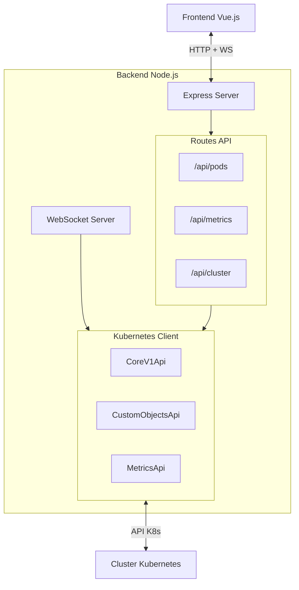
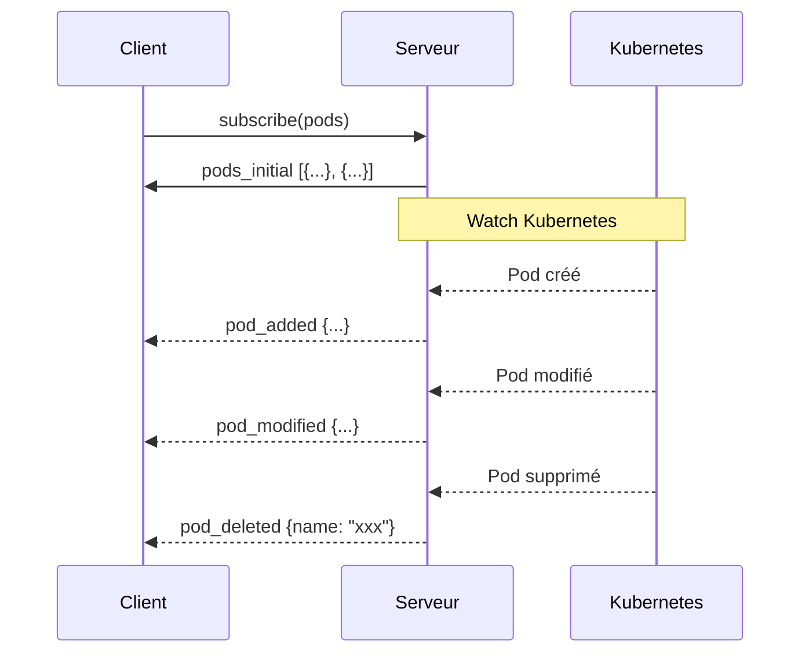
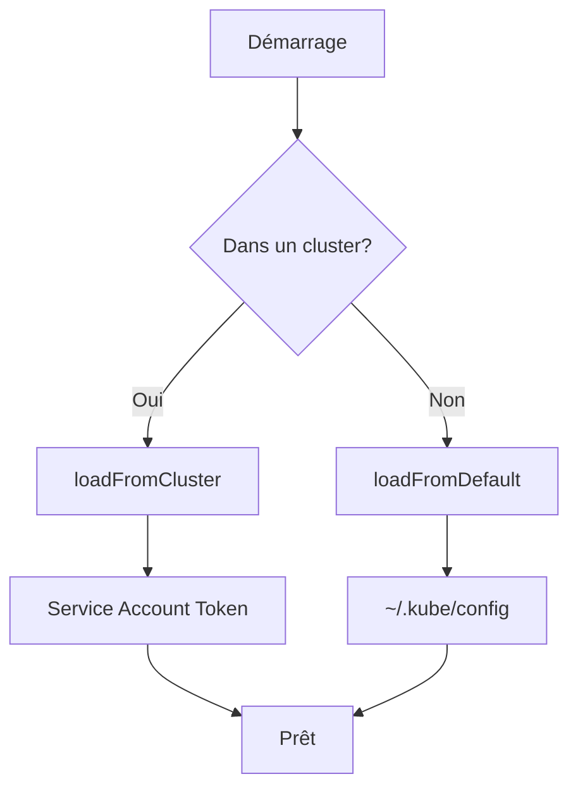

# Backend - secureCodeBox Dashboard

API Node.js/Express qui sert de proxy vers l'API Kubernetes et fournit des WebSockets pour le streaming temps réel.

## Architecture



## Installation

```bash
# Installation des dépendances
npm install

# Mode développement (avec hot reload)
npm run dev

# Build production
npm run build

# Lancement production
npm start
```

## Structure des fichiers

```
backend/
├── src/
│   ├── server.ts              # Point d'entrée Express + WebSocket
│   └── kubernetes/
│       ├── client.ts          # Configuration du client K8s
│       └── pods.ts            # Opérations CRUD sur les pods
├── package.json
├── tsconfig.json
└── Dockerfile
```

## API REST

### Pods

| Endpoint | Méthode | Description |
|----------|---------|-------------|
| `/api/pods` | GET | Liste tous les pods du namespace |
| `/api/pods/:name` | GET | Détail d'un pod spécifique |
| `/api/pods/:name/metrics` | GET | Métriques CPU/MEM du pod |
| `/api/pods/:name/logs` | GET | Logs du pod |
| `/api/pods/:name` | DELETE | Supprime un pod |

### Cluster

| Endpoint | Méthode | Description |
|----------|---------|-------------|
| `/api/cluster/status` | GET | État du cluster (operator, minio, etc.) |
| `/api/metrics/pods` | GET | Métriques de tous les pods |

### Santé

| Endpoint | Méthode | Description |
|----------|---------|-------------|
| `/api/health` | GET | Health check |

## WebSocket

Le serveur WebSocket est disponible sur `/ws`.

### Messages client → serveur

```json
{ "type": "subscribe", "resource": "pods" }
{ "type": "subscribe", "resource": "metrics" }
{ "type": "subscribe", "resource": "logs", "pod": "scan-xxx" }
{ "type": "unsubscribe", "resource": "logs" }
```

### Messages serveur → client



#### Types de messages

| Type | Description |
|------|-------------|
| `pods_initial` | Liste initiale des pods |
| `pod_added` | Nouveau pod créé |
| `pod_modified` | Pod modifié |
| `pod_deleted` | Pod supprimé |
| `metrics` | Mise à jour des métriques (toutes les 5s) |
| `log` | Ligne de log (streaming) |

## Configuration

| Variable | Défaut | Description |
|----------|--------|-------------|
| `PORT` | `8080` | Port du serveur |
| `NAMESPACE` | `securecodebox` | Namespace Kubernetes à surveiller |

## Client Kubernetes

Le client utilise `@kubernetes/client-node` et détecte automatiquement la configuration :



- **En développement** : Utilise `~/.kube/config`
- **En production (dans K8s)** : Utilise le Service Account monté automatiquement

## Types TypeScript

```typescript
interface PodInfo {
  name: string
  namespace: string
  status: string      // Running, Pending, Failed, Succeeded
  ready: string       // "1/1", "0/1"
  restarts: number
  age: string         // "2h15m", "3d"
  ip: string
  node: string
  containers: ContainerInfo[]
}

interface ContainerInfo {
  name: string
  image: string
  ready: boolean
  restarts: number
  ports: PortInfo[]
  env: { name: string; value: string }[]
}

interface PodMetrics {
  name: string
  cpu: number         // millicores
  cpuLimit: number
  memory: number      // bytes
  memoryLimit: number
}
```

## Docker

```bash
# Build
docker build -t securecodebox-dashboard-backend .

# Run
docker run -p 8080:8080 -v ~/.kube:/root/.kube:ro securecodebox-dashboard-backend
```

Le volume `~/.kube` est nécessaire pour accéder à la configuration Kubernetes.

## Tests

```bash
# Tests unitaires
npm test

# Tests avec coverage
npm run test:coverage
```
