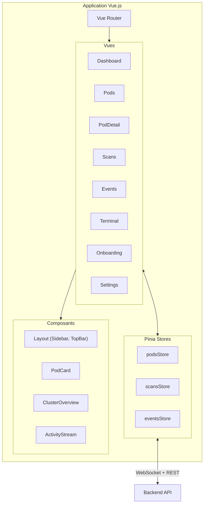
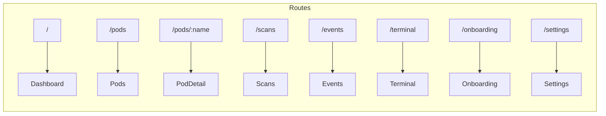
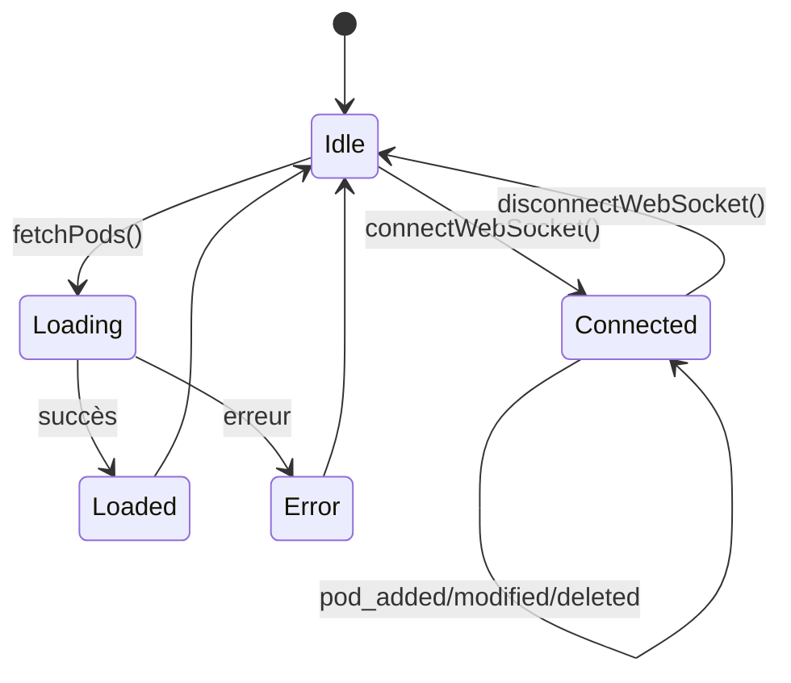
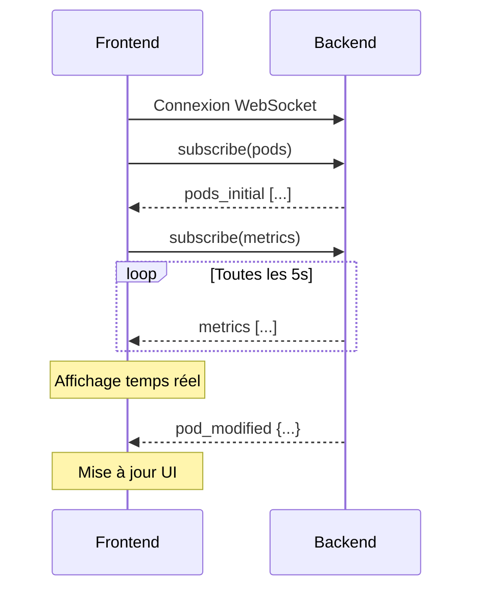
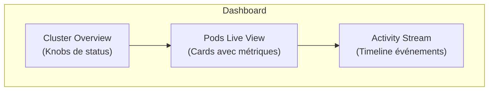

# Frontend - secureCodeBox Dashboard

Interface utilisateur Vue.js 3 avec PrimeVue pour visualiser et piloter secureCodeBox.

## Architecture



## Installation

```bash
# Installation des dépendances
npm install

# Mode développement (avec hot reload)
npm run dev

# Build production
npm run build

# Preview du build
npm run preview
```

## Structure des fichiers

```
frontend/
├── src/
│   ├── main.ts                    # Point d'entrée + config PrimeVue
│   ├── App.vue                    # Layout principal avec sidebar
│   ├── style.css                  # Styles globaux
│   ├── router/
│   │   └── index.ts               # Configuration Vue Router
│   ├── stores/
│   │   └── podsStore.ts           # Store Pinia pour les pods
│   ├── composables/               # Hooks réutilisables
│   ├── components/
│   │   ├── layout/                # Sidebar, TopBar
│   │   ├── dashboard/             # Composants du dashboard
│   │   ├── pods/                  # Composants liés aux pods
│   │   ├── logs/                  # Viewer de logs
│   │   ├── scans/                 # Composants de scans
│   │   ├── terminal/              # Terminal de debug
│   │   └── onboarding/            # Wizard de configuration
│   └── views/                     # Pages
├── index.html
├── vite.config.ts
├── tsconfig.json
└── Dockerfile
```

## Composants PrimeVue utilisés

| Composant | Usage |
|-----------|-------|
| `Card` | Conteneurs de contenu |
| `DataTable` | Tableaux de données |
| `Knob` | Cercles de progression |
| `ProgressBar` | Barres de métriques |
| `Tag` | Badges de status |
| `TabView` | Navigation par onglets |
| `Timeline` | Historique d'événements |
| `Toast` | Notifications |
| `Button` | Actions |
| `InputText` | Champs de saisie |
| `Dialog` | Modales |
| `Sidebar` | Navigation latérale |

## Routing



## Store Pinia (podsStore)



### État

```typescript
interface State {
  pods: PodInfo[]
  metrics: Map<string, PodMetrics>
  loading: boolean
  error: string | null
}
```

### Actions

| Action | Description |
|--------|-------------|
| `fetchPods()` | Récupère la liste des pods |
| `fetchPodMetrics(name)` | Récupère les métriques d'un pod |
| `fetchPodLogs(name, container, tailLines)` | Récupère les logs |
| `deletePod(name)` | Supprime un pod |
| `connectWebSocket()` | Établit la connexion WebSocket |
| `disconnectWebSocket()` | Ferme la connexion WebSocket |

### Getters

| Getter | Description |
|--------|-------------|
| `runningPods` | Pods avec status "Running" |
| `completedPods` | Pods avec status "Succeeded" |
| `failedPods` | Pods avec status "Failed" |

## WebSocket

Le frontend se connecte au WebSocket du backend pour recevoir les mises à jour en temps réel.



## Thème

Le dashboard utilise le thème **Lara Dark Blue** de PrimeVue.

### Variables CSS principales

```css
:root {
  --sidebar-width: 250px;
  --topbar-height: 60px;
  --surface-ground: #121212;
  --surface-card: #1e1e1e;
  --surface-border: #383838;
  --text-color: #ffffff;
  --text-color-secondary: #a1a1aa;
  --primary-color: #3b82f6;
}
```

## Vues

### Dashboard



### Pods

Liste complète des pods avec :
- Filtres par status
- Métriques CPU/MEM temps réel
- Actions (Logs, Delete)

### PodDetail

Vue détaillée d'un pod :
- Informations générales
- Containers avec métriques
- Logs en temps réel
- Export YAML

### Terminal

Interface de debug avec :
- Commandes rapides (boutons)
- Historique des commandes
- Exécution kubectl

### Onboarding

Wizard de configuration en 4 étapes :
1. Diagnostic système
2. Configuration réseau (iptables)
3. Création cluster Kind
4. Installation WPScan

## Docker

```bash
# Build
docker build -t securecodebox-dashboard-frontend .

# Run (nécessite le backend sur :8080)
docker run -p 3000:80 securecodebox-dashboard-frontend
```

L'image utilise nginx pour servir les fichiers statiques et proxy les requêtes vers le backend.

## Configuration Vite

```typescript
// Proxy en développement
server: {
  port: 3000,
  proxy: {
    '/api': 'http://localhost:8080',
    '/ws': {
      target: 'ws://localhost:8080',
      ws: true
    }
  }
}
```
